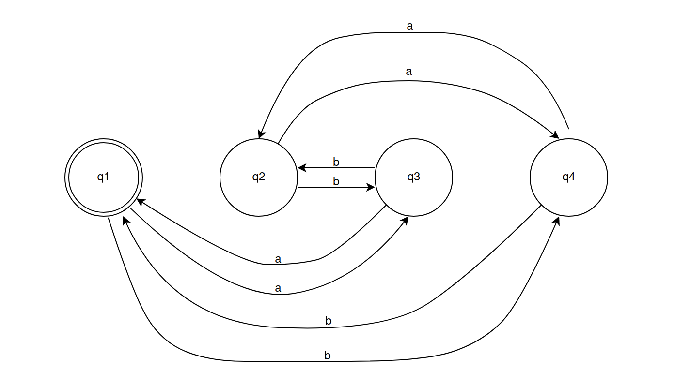

# UDFA — Universal DFA runner

This simple Java application is intended for running deterministic finite-state automatons.

To run the application:

```bash
java udfa file.dfa
```
Where `file.dfa` is a file containing the description of the automaton.

## DFA description file

The syntax of the DFA description file is very simple. 

### Comments

Lines beginning with `#` (hash sign) are comments:

```
# This is a comment
```

### States

Line beginning with `Q:` (uppercase Q followed by a colon) lists all states of the DFA, separated by commas.

```
Q:q0,q1,q2,q3
```

Line beginning with `S:` (uppercase S followed by a colon) determines the initial state. The initial state should be already defined in the `Q:` line:

```
S:q0
```

Line beginning with `A:` (uppercase A followed by a colon) lists the acceptance states of the DFA. The acceptance states should be already defined in the `Q:` line:

```
A:q2,q3
```

### Alphabet

Line beginning with `L:` (uppercase L followed by a colon) lists all symbols in the alphabet on which the DFA operates.

```
L:a,b,c,d
```

### Transitions

Transitions are defined in the following way: `old_state,symbol->new_state`, e.g.:

```
q0,d->q2
```

## Example

The following DFA operates on the alphabet consisting of symbols `(a,b)` and accepts all strings that contain even number of `a`'s and `b`'s (e.g. `aabb`, `bbaa`, `abba`, `baaabbba` etc.):



A DFA file describing this state machine would look like this:

```
# this DFA accepts strings where the number of a's and the number of b's are both even
Q: q1,q2,q3,q4
L: a,b
S: q1
A: q1
q1,a->q3
q1,b->q4
q3,a->q1
q3,b->q2
q2,a->q4
q2,b->q3
q4,a->q2
q4,b->q1
```
